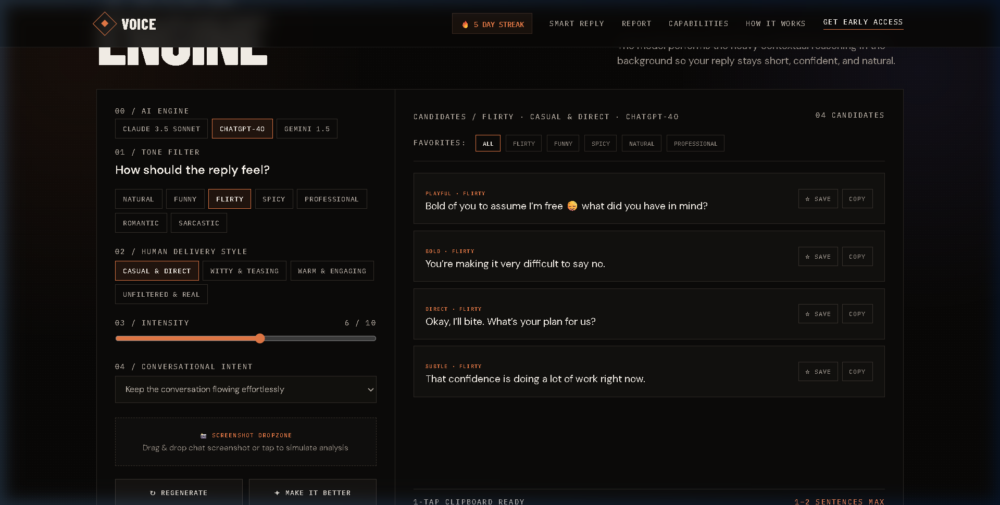
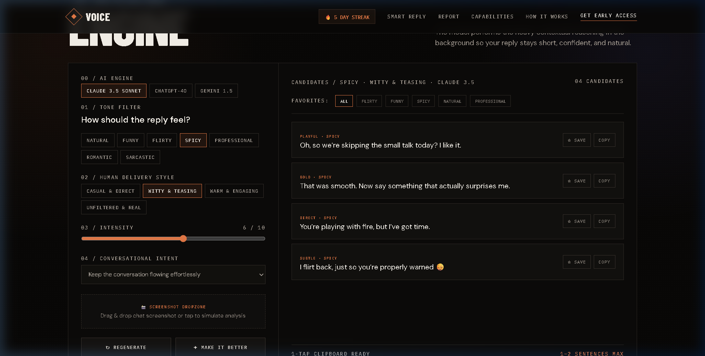
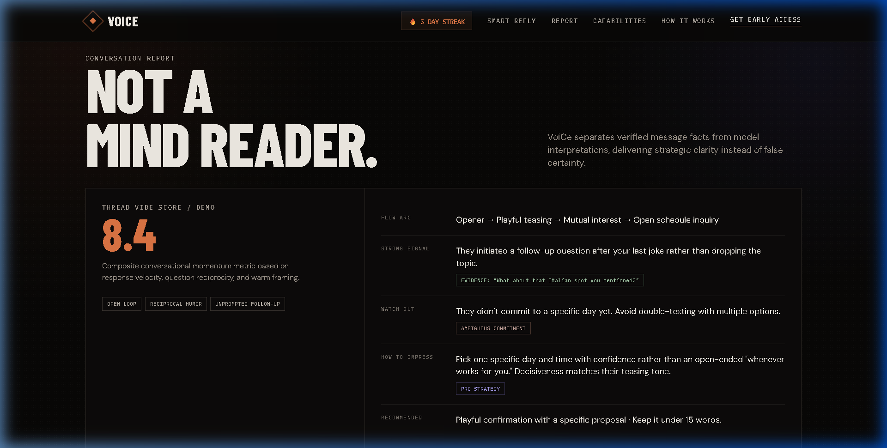
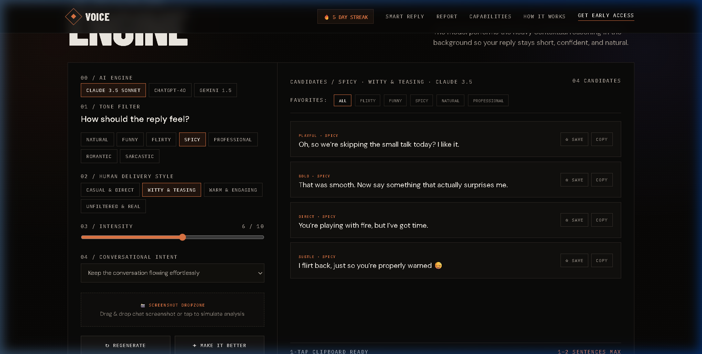
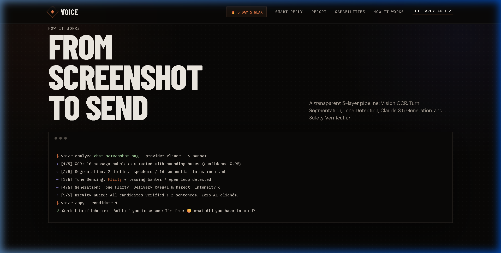
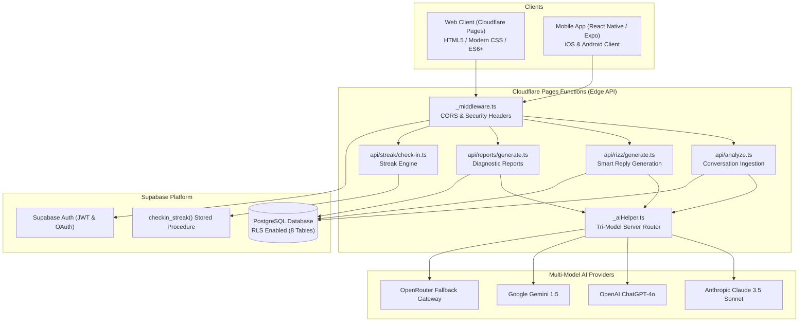

# 📱 VoiCe — AI Conversational Intelligence & Smart Reply Platform

<div align="center">

[](https://voice-ai-cpp.pages.dev/)
[](https://supabase.com/)
[](https://expo.dev/)
[](https://www.typescriptlang.org/)
[](https://anthropic.com/)
[](LICENSE)

<br />

**Never wonder what to say again.**
<br />
*Real human conversation intelligence. No robotic fluff. No cringe slang. Just authentic, charismatic replies crafted in 1–2 sentences.*

<br />


</div>

---

## 📖 Table of Contents

- [Overview](#-overview)
- [Human-First Philosophy](#-human-first-philosophy)
- [Key Features](#-key-features)
  - [1. Tri-Model AI Intelligence Hub](#1-tri-model-ai-intelligence-hub)
  - [2. 7 Nuanced Tone Registers](#2-7-nuanced-tone-registers)
  - [3. 4 Delivery Styles & Intensity Control](#3-4-delivery-styles--intensity-control)
  - [4. Deep Conversation Diagnostic Report](#4-deep-conversation-diagnostic-report)
  - [5. Categorized Favorites & Streaks](#5-categorized-favorites--streaks)
- [Screenshots & Visual Tour](#-screenshots--visual-tour)
- [System Architecture](#-system-architecture)
- [Security & Master Auth Hardening](#-security--master-auth-hardening)
- [Project Directory Structure](#-project-directory-structure)
- [Getting Started](#-getting-started)
  - [Prerequisites](#prerequisites)
  - [Environment Configuration](#environment-configuration)
  - [Running the Web Client](#running-the-web-client)
  - [Running the Mobile App (Expo)](#running-the-mobile-app-expo)
  - [Running Automated Tests](#running-automated-tests)
- [Deployment Guide](#-deployment-guide)
  - [Cloudflare Pages Deployment](#cloudflare-pages-deployment)
  - [Supabase Database Setup](#supabase-database-setup)
- [Contributing & License](#-contributing--license)

---

## 💡 Overview

**VoiCe** is a high-performance conversational intelligence and smart reply generation engine built for both Web and Mobile. Whether analyzing screenshots from iMessage, WhatsApp, Instagram DMs, Tinder, Bumble, or Slack, VoiCe reads between the lines of human interactions, detects psychological subtext, and crafts short, contextual, and charismatic responses.

---

## 🎯 Human-First Philosophy

Early "rizz" and AI chat apps suffered from two fatal flaws:
1. **Robotic Clichés:** Stiff, corporate phrasing like *"I'd love to circle back on our chat"* or *"That sounds delightful!"*
2. **Cringe Gimmicks:** Overused internet slang and cheesy pickup lines that ruin genuine human connection.

**VoiCe enforces strict human communication invariants:**
- **Brevity Invariant:** Replies are strictly capped at 1–2 punchy sentences. Real people text concisely.
- **Natural Cadence:** Natural punctuation, casual capitalization, conversational rhythm, and organic wit.
- **Zero AI Brochure Speak:** Banned from using robotic transition words or overly formal language.

---

## ✨ Key Features

### 1. Tri-Model AI Intelligence Hub
Seamlessly route requests through the world's most capable large language models:
* **Anthropic Claude 3.5 Sonnet:** Unrivaled at subtle emotional subtext, relaxed texting cadence, and psychological nuance.
* **OpenAI ChatGPT-4o:** Fast, witty, culturally tuned, and razor-sharp comebacks.
* **Google Gemini 1.5:** Expansive context comprehension and high-speed multi-modal screenshot parsing.

*(All LLM calls are orchestrated through serverless edge functions with automatic OpenRouter fallbacks — client code never handles raw API keys).*



### 2. 7 Nuanced Tone Registers
* **Natural:** Effortless, grounded everyday banter with zero pretense.
* **Funny:** Dry wit, light situational humor, and clever observations.
* **Flirty:** Playful chemistry, warm undertones, and magnetic charm.
* **Spicy:** Bold, provocative, cheeky, and confident tension.
* **Professional:** Polished, respectful, clear, and boundary-conscious.
* **Romantic:** Sincere, poetic, earnest emotional depth.
* **Sarcastic:** Deadpan snark, dry remarks, and humorous eye-rolls.

### 3. 4 Delivery Styles & Intensity Control
Fine-tune how your message is delivered:
* **Chill / Low-Stakes:** No pressure, laid-back vibe.
* **Bold / Direct:** Decisive, cuts through hesitation, takes initiative.
* **Witty / Teasing:** Banter-forward, playful challenge.
* **Warm / Empathetic:** Emotionally perceptive and supportive.
* **Granular Intensity Slider (1–10):** Dial anywhere from subtle nudges to unapologetic confidence.



### 4. Deep Conversation Diagnostic Report
Beyond generating replies, VoiCe functions as an interpersonal diagnostic tool:
* **Conversation Flow Arc:** Evaluates momentum, emotional temperature, and effort balance (e.g., *62% You / 38% Them*).
* **Subtext & Unspoken Cues:** Decodes what the other person actually means beneath the surface.
* **Red & Green Flags:** Identifies behavioral cues and cites direct evidence from the chat.
* **Actionable Pro Tips:** Provides tactical recommendations on response timing, topic shifts, and moving conversations into real-world dates.



### 5. Categorized Favorites & Streaks
* **1-Tap Instant Copy:** Copy any reply with immediate visual feedback.
* **Categorized Vault:** Organize saved replies into tags (`Opener`, `Comeback`, `Date Request`, `Recovery`, `Deep Talk`).
* **Daily Streaks:** Gamified streak check-ins with an idempotent PostgreSQL backend to build daily conversational confidence.



---

## 📸 Screenshots & Visual Tour

| Feature | Visual Preview |
|---|---|
| **App Capabilities Grid** |  |
| **Tri-Model Engine** |  |
| **Diagnostic Report** |  |

---

## 🏗️ System Architecture



---

## 🛡️ Security & Master Auth Hardening

VoiCe adheres to strict security and authorization practices:

1. **Zero Client-Side Keys:** All API tokens (Anthropic, OpenAI, Gemini, Supabase Service Role) reside strictly in serverless environment variables.
2. **Authorization Over Authentication:** The API strictly prohibits taking `user_id` from request bodies. All mutations resolve identity exclusively from the cryptographically verified `auth.uid()` token.
3. **Strict Row-Level Security (RLS):** All 8 Supabase tables (`profiles`, `conversations`, `messages`, `generations`, `replies`, `favorites`, `reports`, `streaks`) have explicit RLS policies preventing unauthorized access (IDOR protection).
4. **Idempotent Streak Check-ins:** Database procedures calculate streaks using server timestamps to prevent replay exploits.

---

## 📂 Project Directory Structure

```text
VoiCe/
├── .env.example               # Sanitized environment variable template
├── .gitignore                  # Git ignore protecting secrets, builds, and node_modules
├── Architecture.md             # Detailed engineering and tri-model architecture spec
├── PRD.md                      # Product Requirements Document
├── Rules.md                    # Coding and design rules
├── decisions.md                # Architecture Decision Records (ADR-001 - ADR-014)
├── wrangler.toml               # Cloudflare Pages deployment configuration
├── tsconfig.json               # Root TypeScript configuration
│
├── docs/                       # Documentation and project assets
│   └── screenshots/            # High-resolution screenshots of the UI in action
│
├── web/                        # Web Frontend & Cloudflare Pages Functions
│   ├── index.html              # Dark obsidian landing page & interactive VoiCe engine
│   ├── package.json            # Web dependencies & scripts
│   ├── tsconfig.json           # Web TypeScript configuration
│   └── functions/              # Cloudflare Pages Serverless Edge API
│       └── api/
│           ├── _aiHelper.ts    # Multi-model server router (Claude, GPT-4o, Gemini)
│           ├── _middleware.ts  # CORS, security headers & auth extraction
│           ├── analyze.ts      # Screenshot & conversation ingestion
│           ├── rizz/           # Smart reply generation and iterative polish
│           ├── reports/        # Conversation flow diagnostic report generation
│           └── streak/         # Daily streak check-in handler
│
├── mobile/                     # React Native / Expo Cross-Platform Mobile Client
│   ├── App.tsx                 # Root entry point
│   ├── app.json                # Expo application manifest
│   ├── eas.json                # Expo Application Services (EAS) build profiles
│   ├── package.json            # Mobile dependencies
│   ├── tsconfig.json           # Mobile TypeScript configuration (0 errors)
│   └── src/
│       ├── screens/            # Home, Diagnostic Report, Favorites, History screens
│       ├── services/           # Supabase & Cloudflare Pages Edge API client
│       ├── store/              # Zustand global state (Voice, Favorites, Streak)
│       └── theme/              # Obsidian dark palette & typography tokens
│
├── supabase/                   # Supabase PostgreSQL Database
│   └── schema.sql              # Complete database schema, RLS policies & RPC functions
│
└── tests/                      # Automated Verification Test Suite
    └── voice.test.js           # 6 test suites covering brevity, tone, streaks, and RLS
```

---

## 🚀 Getting Started

### Prerequisites
* **Node.js**: v18.0.0 or higher (v20+ recommended)
* **npm** or **yarn**
* **Git**

### Environment Configuration
1. Clone this repository:
   ```bash
   git clone https://github.com/nabani19/VoiCe.git
   cd VoiCe
   ```
2. Create a local `.env` file based on [.env.example](.env.example):
   ```bash
   cp .env.example .env
   ```
3. Populate your API credentials in `.env`:
   ```env
   ANTHROPIC_API_KEY="sk-ant-..."
   OPENAI_API_KEY="sk-proj-..."
   GEMINI_API_KEY="..."
   OPENROUTER_API_KEY="sk-or-v1-..."
   SUPABASE_URL="https://your-project.supabase.co"
   SUPABASE_ANON_KEY="your-anon-key"
   ```

---

### Running the Web Client

To run the web landing page and interactive engine locally:

```bash
# Option 1: Standard lightweight static preview
npx serve -l 4173 web

# Option 2: Full Cloudflare Pages local simulation with Functions
cd web
npm install
npx wrangler pages dev . --port 8788
```

Open [http://localhost:4173](http://localhost:4173) or [http://localhost:8788](http://localhost:8788) in your browser.

---

### Running the Mobile App (Expo)

To test the mobile app on iOS, Android, or Expo Go:

```bash
cd mobile
npm install
npx expo start
```

* **Physical Device**: Scan the QR code using the **Expo Go** app (iOS Camera or Android Expo Go).
* **Android Emulator**: Press `a` in the terminal.
* **iOS Simulator**: Press `i` in the terminal.
* **Web Mobile Preview**: Press `w` in the terminal.

To compile a standalone Android APK:
```bash
npx eas build -p android --profile preview
```

---

### Running Automated Tests

Run the complete verification test suite:

```bash
node tests/voice.test.js
```

**Test Coverage:**
- ✅ **Brevity Invariant**: Validates replies are ≤ 2 sentences.
- ✅ **Human Tone**: Checks against robotic AI clichés.
- ✅ **Idempotent Streaks**: Verifies duplicate check-ins on the same day do not inflate counts.
- ✅ **Categorized Favorites**: Confirms tag filtering.
- ✅ **Master Auth / IDOR**: Proves client user IDs are ignored and server identities enforced.
- ✅ **Tri-Model Engine**: Validates routing between Claude 3.5 Sonnet, ChatGPT-4o, and Gemini 1.5.

---

## 🌐 Deployment Guide

### Cloudflare Pages Deployment

1. Install Wrangler and authenticate:
   ```bash
   npx wrangler login
   ```
2. Deploy the `web/` directory and Functions:
   ```bash
   npx wrangler pages deploy web --project-name voice-ai
   ```
3. In the Cloudflare Dashboard, add the required environment variables:
   - `ANTHROPIC_API_KEY`
   - `OPENAI_API_KEY`
   - `OPENROUTER_API_KEY`
   - `SUPABASE_URL`
   - `SUPABASE_ANON_KEY`

Your app will be live at `https://voice-ai.pages.dev`!

---

### Supabase Database Setup

1. Create a project on [supabase.com](https://supabase.com).
2. Navigate to the **SQL Editor** in your Supabase dashboard.
3. Paste the contents of [supabase/schema.sql](supabase/schema.sql) and click **Run**.
4. The script will automatically create:
   - All 8 database tables with foreign keys and cascade rules.
   - Row-Level Security (RLS) policies for user data isolation.
   - The `checkin_streak(target_user_id)` stored procedure.

---

## 📄 License

This project is licensed under the **MIT License** — see the [LICENSE](LICENSE) file for details.

---

<div align="center">
  <sub>Engineered with precision for authentic human connection. Built by <a href="https://github.com/nabani19">nabani19</a>.</sub>
</div>
